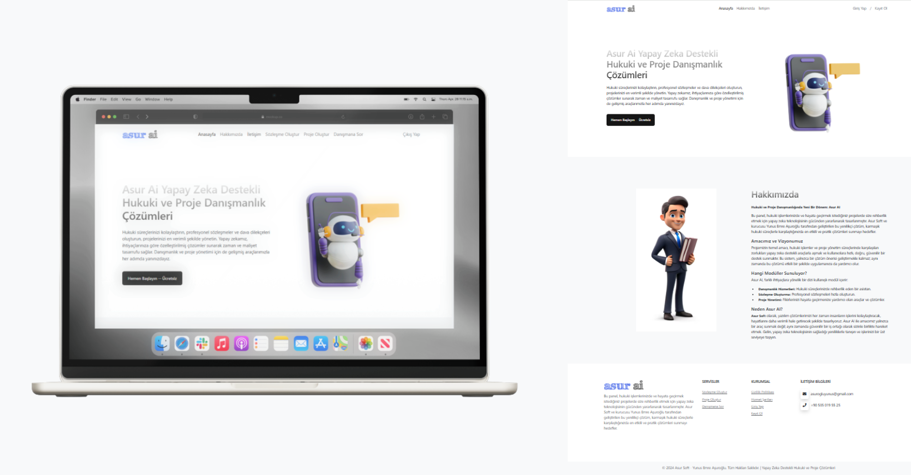
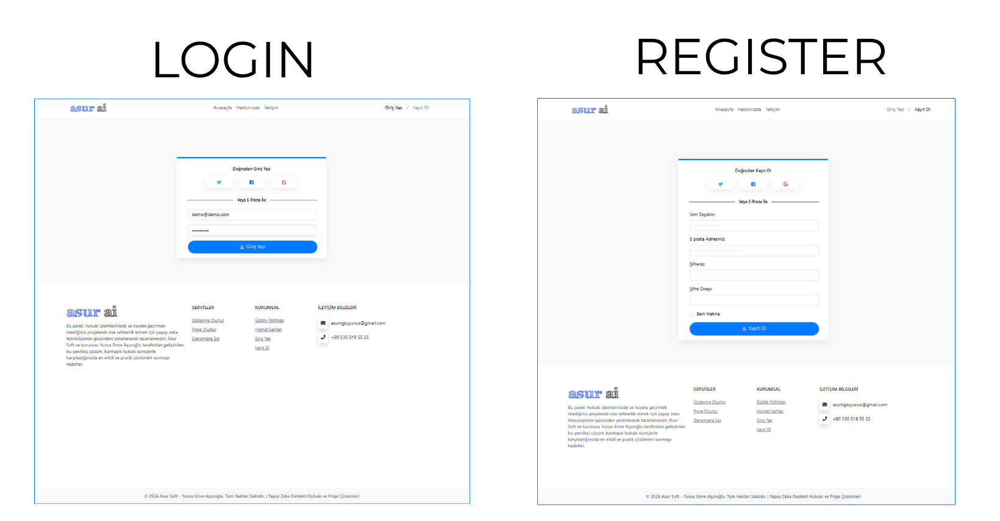
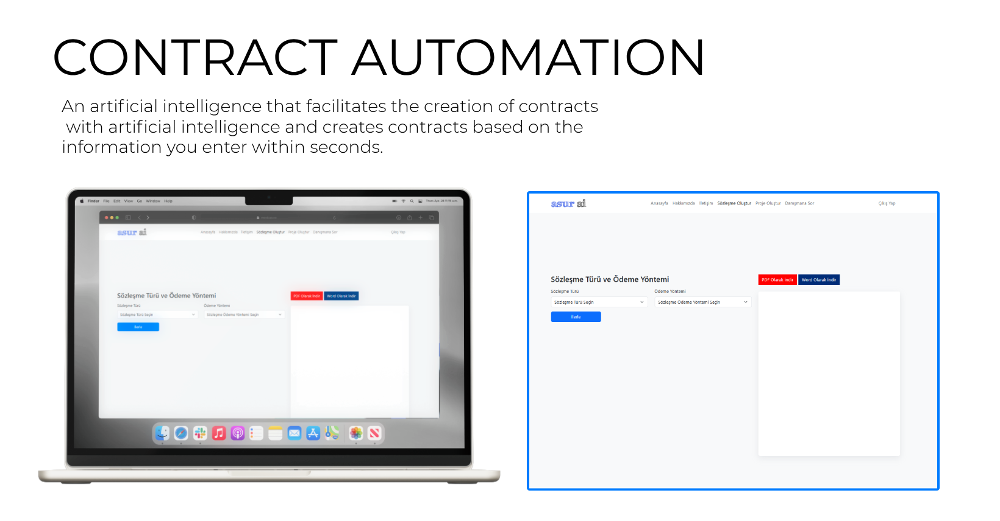
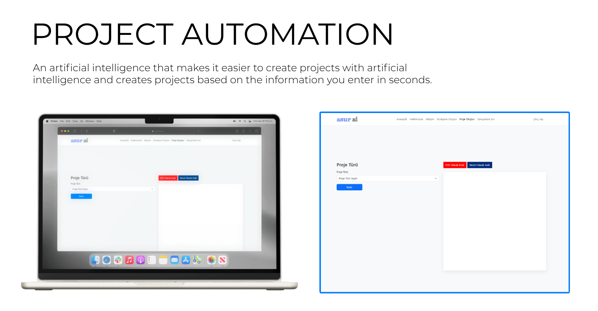

## Asur Ai
Asruai is a web software project with artificial intelligence infrastructure that makes work easier for many sectors, especially legal ones.

## Home Page and Auth

  
  

## Contract Automation Page

On this page, you can create any contract you want by filling out the form and it is easy and useful.

  

## Project Automation Page

On this page, you can create any project you want by filling out the form and it is easy and useful.

  

## Advisor bot

A bot that you can ask whatever you want has an artificial intelligence infrastructure and is specially adjusted to give the best results.

  

## Requirements

- PHP 8.0 or above
- Composer

## Contribute

1. Fork this project.
2. Create a new feature branch (`feature/feature-adi`).
3. Commit your changes (`git commit -m 'New feature added'`).
4. Push the branch to master (`git push origin feature/feature-adi`).
5. Open a Pull Request.

## Licence
This project is licensed under the [MIT License](LICENSE).
